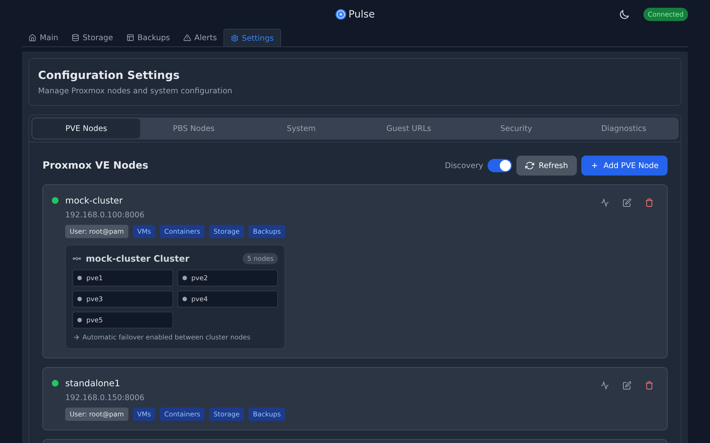

# FAQ

## Installation

### What's the easiest way to install?
```bash
curl -fsSL https://raw.githubusercontent.com/rcourtman/Pulse/main/install.sh | bash
```

### System requirements?
- 1 vCPU, 512MB RAM (1GB recommended), 1GB disk
- Network access to Proxmox API

## Configuration

### How do I add a node?
**Auto-discovery (Easiest)**: Settings → Nodes → Click "Setup Script" on discovered node → Run on Proxmox
**Manual**: Settings → Nodes → Add Node → Enter credentials → Save



### How do I disable network discovery?
Settings → System → Network Settings → Toggle "Enable Discovery" off → Save
Or set environment variable `DISCOVERY_ENABLED=false`

### How do I change the port?
Systemd: `sudo systemctl edit pulse`, add `Environment="FRONTEND_PORT=8080"`, restart
Docker: Use `-e FRONTEND_PORT=8080 -p 8080:8080` in your run command
See [Port Configuration Guide](PORT_CONFIGURATION.md) for details

### Why can't I change settings in the UI?
If a setting is disabled with an amber warning, it's being overridden by an environment variable. 
Remove the env var (check `sudo systemctl show pulse | grep Environment`) and restart to enable UI configuration.

### What permissions needed?
- PVE: `PVEAuditor` minimum (includes VM.GuestAgent.Audit for disk usage in PVE 9+)
- PVE 8: Also needs `VM.Monitor` permission for VM disk usage via QEMU agent
- PBS: `DatastoreReader` minimum

### API tokens vs passwords?
API tokens are more secure. Create in Proxmox: Datacenter → Permissions → API Tokens

### Where are settings stored?
See [Configuration Guide](CONFIGURATION.md) for details

### How do I backup my configuration?
Settings → Security → Backup & Restore → Export Backup
- If logged in with password: Just enter your password or a custom passphrase
- If using API token only: Provide the API token when prompted
- Includes all settings, nodes, credentials (encrypted), and custom console URLs

### Can Pulse detect Proxmox clusters?
Yes! When you add one cluster node, Pulse automatically discovers and monitors all nodes

## Troubleshooting

### No data showing?
- Check Proxmox API is reachable (port 8006/8007)
- Verify credentials
- Check logs: `journalctl -u pulse -f`

### Connection refused?
- Check port 7655 is open
- Verify Pulse is running: `systemctl status pulse`

### PBS connection issues?
- PBS requires HTTPS (not HTTP) - use `https://your-pbs:8007`
- Default PBS port is 8007 (not 8006)
- Check firewall allows port 8007

### Invalid credentials?
- Check username includes realm (@pam, @pve)
- Verify API token not expired
- Confirm user has required permissions

### CORS errors in browser?
- By default, Pulse only allows same-origin requests
- Set `ALLOWED_ORIGINS` environment variable for cross-origin access
- Example: `ALLOWED_ORIGINS=https://app.example.com`
- Never use `*` in production

### Authentication issues?
- Password auth: Check `PULSE_AUTH_USER` and `PULSE_AUTH_PASS` environment variables
- API token: Verify `API_TOKEN` is set correctly
- Session expired: Log in again via web UI
- Account locked: Wait 15 minutes after 5 failed attempts

### High memory usage?
Reduce `metricsRetentionDays` in settings and restart

## Features

### Why do VMs show 0% disk usage?
This is usually one of these issues:

**Proxmox 9**: VM disk monitoring should work with proper setup:
- API tokens CAN access guest agent data (confirmed working)
- Ensure your token has proper permissions (PVEAuditor role includes VM.GuestAgent.Audit)
- The `/cluster/resources` endpoint shows disk=0 but Pulse fetches actual data via guest agent API
- If you see 0%, check: guest agent installed/running, token permissions, and Pulse logs for errors
- Note: Container (LXC) disk usage always works fine

**Proxmox 8**: Check that:
1. QEMU Guest Agent is installed and running in the VM
2. Your API token has `VM.Monitor` permission
   - If you added this node before Pulse v4.7, you need to re-run the setup script
   - Or manually add: `pveum role add PulseMonitor -privs VM.Monitor && pveum aclmod / -user pulse-monitor@pam -role PulseMonitor`

**All versions**: 
- Guest agent must be installed: `apt install qemu-guest-agent` (Linux) or virtio-win tools (Windows)
- Enable in VM Options → QEMU Guest Agent
- The service should start automatically after install. To verify:
  - Check status: `systemctl status qemu-guest-agent`
  - If not running: `systemctl start qemu-guest-agent` (not `enable` - it's socket-activated)
  - Alternative check: `ps aux | grep qemu-ga`
- Restart the VM after installing/enabling in Proxmox options

**Still showing 0%?**
- Verify from Proxmox host: `qm agent <VMID> get-fsinfo`
- If that works but Pulse doesn't show it, check Pulse logs for errors
- Some VMs may need: `systemctl restart qemu-guest-agent` inside the VM
- Windows VMs: Ensure QEMU Guest Agent VSS Provider service is running

### How do I see real disk usage for VMs?
Install QEMU Guest Agent in your VMs:
- Linux: `apt install qemu-guest-agent` or `yum install qemu-guest-agent`
- Windows: Install virtio-win guest tools
- Enable in VM Options → QEMU Guest Agent
- Restart the VM for changes to take effect
See [VM Disk Monitoring Guide](VM_DISK_MONITORING.md) for details.

### Multiple clusters?
Yes, add multiple nodes in Settings

### PBS push mode?
No, PBS push mode is not currently supported. PBS monitoring requires network connectivity from Pulse to the PBS server.

### Webhook providers?
Discord, Slack, Gotify, Telegram, ntfy.sh, Teams, generic JSON

### Works with reverse proxy?
Yes, ensure WebSocket support is enabled

## Updates

### How to update?
- **Docker**: Pull latest image, recreate container  
- **Manual/systemd**: Run the install script again: `curl -fsSL https://raw.githubusercontent.com/rcourtman/Pulse/main/install.sh | bash`

### Why can't I update from the UI?
For security reasons, Pulse cannot self-update. The UI will notify you when updates are available and show the appropriate update command for your deployment type.

### Will updates break config?
No, configuration is preserved